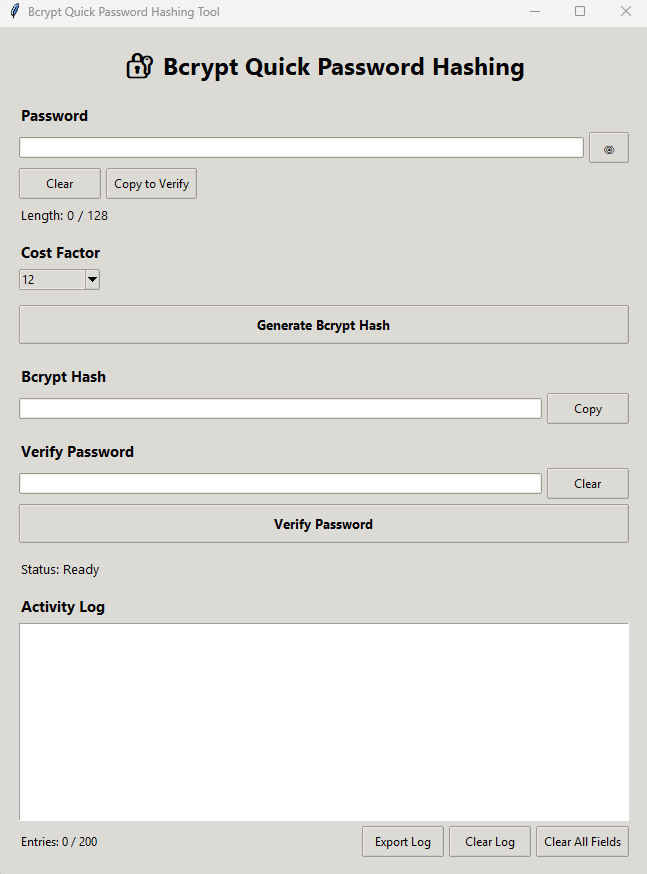
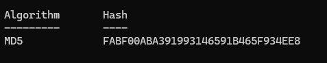

# Bcrypt Quick Password Hashing Tool

A small Python desktop application for generating and verifying **bcrypt password hashes**.

The application provides a simple GUI for securely testing password hashing and verification locally, with configurable bcrypt cost factors and a session-based activity log.



## Features

* Generate bcrypt password hashes
* Verify passwords against bcrypt hashes
* Configurable bcrypt cost factor

  * 10
  * 11
  * 12
  * 13
  * 14
* Default cost factor of 12
* Password length indicator
* Password visibility toggle
* Maximum password length of 128 characters
* Copy password directly to the verification field
* Copy generated bcrypt hashes to the system clipboard
* Clear individual fields
* Clear all working fields
* Session-based activity log
* Activity log limited to 200 entries
* Export activity logs as `.txt` files
* Activity logs do not record plaintext passwords or password hashes

## Technologies

* **Python**
* **Tkinter** - Graphical user interface
* **bcrypt** - Password hashing and verification
* **Pathlib** - File and path handling
* **datetime** - Activity log timestamps

## How Bcrypt Works

Bcrypt is a password hashing algorithm designed to make password guessing more computationally expensive.

When generating a hash, the application:

1. Accepts the password entered by the user.
2. Generates a random salt using bcrypt.
3. Applies the selected cost factor.
4. Generates the bcrypt password hash.
5. Displays the resulting hash in the application.

The salt is automatically generated by bcrypt and is stored as part of the resulting bcrypt hash.

When verifying a password, bcrypt uses the information contained in the stored hash to perform the verification.

## Installation

### Option 1: Windows Executable

Download the Windows `.exe` from the repository's Releases section.

The executable is provided as a compressed `.zip` file. Extract the ZIP file and run:

```text
bcrypt_tool.exe
```

No Python installation is required when using the executable.

#### MD5 Checksum

Use the following MD5 checksum to verify the downloaded `Bcrypt-Tool.zip` file:

```text
FABF00ABA391993146591B465F934EE8
```


### Option 2: Run from Source

Clone the repository:

```bash
git clone https://github.com/D-Emerald/Bcrypt-Tool.git
```

Navigate into the project directory:

```bash
cd Bcrypt-Tool
```

Install the required dependency:

```bash
pip install bcrypt
```

Run the application:

```bash
python bcrypt_tool.py
```

Alternatively, download the repository as a ZIP file, extract it, install the `bcrypt` dependency, and run the Python file.

## Usage

### Generate a Hash

1. Enter a password.
2. Select the desired bcrypt cost factor.
3. Click **Generate Bcrypt Hash**.
4. The generated bcrypt hash will appear in the hash field.

### Verify a Password

1. Enter a password into the verification field.
2. Enter or generate a bcrypt hash.
3. Click **Verify Password**.
4. The application reports whether the password matches the hash.

### Activity Log

The activity log records application events such as:

```text
19:42:11 | Hash generated | Cost: 12
19:42:18 | Hash copied
19:42:31 | Password verification | Success
```

The log intentionally does **not** record:

* Plaintext passwords
* Verification passwords
* Bcrypt hashes
* Bcrypt salts

The activity log is session-based and can be exported to a `.txt` file in the user's Downloads folder.

## Author

**Dev Emerald**

Cyber Security Student
